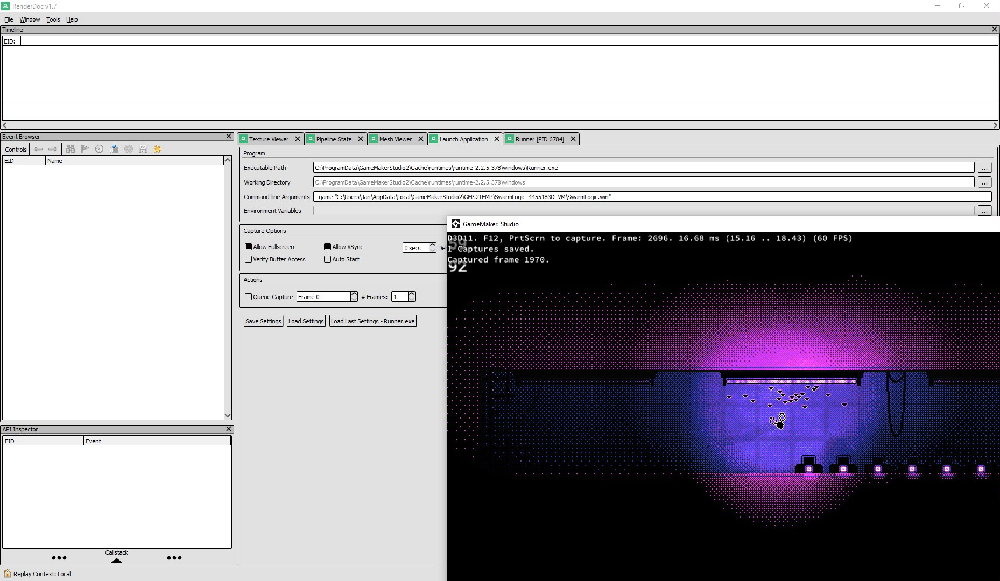
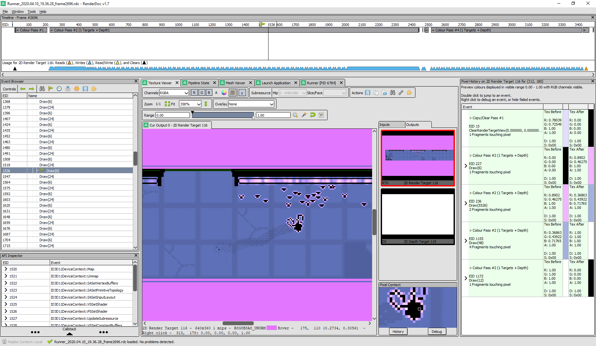

# renderdoc-gms2-kit

## What?
Since GameMaker:Studio 2 generates development builds in such a way that makes it hard to debug them inside [RenderDoc](https://renderdoc.org/ "An essential tool for every graphics programmer."), I've developed a PowerShell script that automatically finds the path to the latest build and generates a settings file that can be loaded into the aforementioned tool.

## How to?
1) Inside GMS2, run and close the game. This will create a temporary build.
2) Depending on your requirements, run one of the provided scripts. If all goes well, a _*.cap_ file will be generated.
3) If you have it installed, double-clicking the newly-created settings file should open up RenderDoc with the settings already in place. You can also load it directly in the GUI (_Launch Application -> Load Settings_).
4) Click the _Launch_ button, this will start the game via RenderDoc. Proceed as you normally would.

## The script comes in two flavours:

[renderdoc_generate_latest.ps1](renderdoc_generate_latest.ps1) - Generates a settings file for the last created GMS2 build, you can run this from wherever you like.   
[renderdoc_generate_project.ps1](renderdoc_generate_project.ps1) - A project-specific version of the former, needs to be placed in the folder where the .yyp file is. 

## Additional notes

You can modify the other launch settings inside RenderDoc however you like and overwrite the original settings file. After that, when you run the script again, your changes will be kept.

GMS2 uses temporary mount points to run the development builds from. I did not implement this, as it would require providing a separate script to do the unmounting, which would be unpractical. As far as I can tell, using the absolute paths instead seems to work fine, but if you run into issues, let me know.

This works with both YYC and VM builds.   
A relatively new version of Windows 10 required.

 ### Written by [@odditica](https://twitter.com/odditica).    

 ---

   

